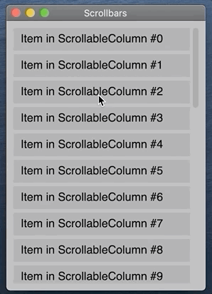

# Desktop components

## What is covered

In this tutorial, we will show you how to use desktop-specific components of Compose for Desktop such as scrollbars and tooltips.

## Scrollbars

You can apply scrollbars to scrollable components. The scrollbar and scrollable components share a common state to synchronize with each other. For example, `VerticalScrollbar` can be attached to `Modifier.verticalScroll`, and `LazyColumnFor` and `HorizontalScrollbar` can be attached to `Modifier.horizontalScroll` and `LazyRowFor`.

```kotlin
import androidx.compose.desktop.Window
import androidx.compose.foundation.HorizontalScrollbar
import androidx.compose.foundation.VerticalScrollbar
import androidx.compose.foundation.background
import androidx.compose.foundation.horizontalScroll
import androidx.compose.foundation.layout.Box
import androidx.compose.foundation.layout.Column
import androidx.compose.foundation.layout.Spacer
import androidx.compose.foundation.layout.fillMaxHeight
import androidx.compose.foundation.layout.fillMaxSize
import androidx.compose.foundation.layout.fillMaxWidth
import androidx.compose.foundation.layout.height
import androidx.compose.foundation.layout.padding
import androidx.compose.foundation.layout.width
import androidx.compose.foundation.rememberScrollState
import androidx.compose.foundation.rememberScrollbarAdapter
import androidx.compose.foundation.verticalScroll
import androidx.compose.material.Text
import androidx.compose.runtime.Composable
import androidx.compose.ui.Alignment
import androidx.compose.ui.Modifier
import androidx.compose.ui.graphics.Color
import androidx.compose.ui.unit.IntSize
import androidx.compose.ui.unit.dp

fun main() {
    Window(title = "Scrollbars", size = IntSize(250, 400)) {
        Box(
            modifier = Modifier.fillMaxSize()
                .background(color = Color(180, 180, 180))
                .padding(10.dp)
        ) {
            val stateVertical = rememberScrollState(0)
            val stateHorizontal = rememberScrollState(0)

            Box(
                modifier = Modifier
                    .fillMaxSize()
                    .verticalScroll(stateVertical)
                    .padding(end = 12.dp, bottom = 12.dp)
                    .horizontalScroll(stateHorizontal)
            ) {
                Column {
                    for (item in 0..30) {
                        TextBox("Item #$item")
                        if (item < 30) {
                            Spacer(modifier = Modifier.height(5.dp))
                        }
                    }
                }
            }
            VerticalScrollbar(
                modifier = Modifier.align(Alignment.CenterEnd)
                    .fillMaxHeight(),
                adapter = rememberScrollbarAdapter(stateVertical)
            )
            HorizontalScrollbar(
                modifier = Modifier.align(Alignment.BottomStart)
                    .fillMaxWidth()
                    .padding(end = 12.dp),
                adapter = rememberScrollbarAdapter(stateHorizontal)
            )
        }
    }
}

@Composable
fun TextBox(text: String = "Item") {
    Box(
        modifier = Modifier.height(32.dp)
            .width(400.dp)
            .background(color = Color(200, 0, 0, 20))
            .padding(start = 10.dp),
        contentAlignment = Alignment.CenterStart
    ) {
        Text(text = text)
    }
}
```


## Lazy scrollable components with Scrollbar

You can use scrollbars with lazy scrollable components, for example, `LazyColumn`.

```kotlin
import androidx.compose.desktop.Window
import androidx.compose.foundation.ExperimentalFoundationApi
import androidx.compose.foundation.VerticalScrollbar
import androidx.compose.foundation.background
import androidx.compose.foundation.layout.Box
import androidx.compose.foundation.layout.Spacer
import androidx.compose.foundation.layout.fillMaxHeight
import androidx.compose.foundation.layout.fillMaxSize
import androidx.compose.foundation.layout.fillMaxWidth
import androidx.compose.foundation.layout.height
import androidx.compose.foundation.layout.padding
import androidx.compose.foundation.lazy.LazyColumn
import androidx.compose.foundation.lazy.rememberLazyListState
import androidx.compose.foundation.rememberScrollbarAdapter
import androidx.compose.material.Text
import androidx.compose.runtime.Composable
import androidx.compose.ui.Alignment
import androidx.compose.ui.Modifier
import androidx.compose.ui.graphics.Color
import androidx.compose.ui.unit.IntSize
import androidx.compose.ui.unit.dp

fun main() {
    Window(title = "Scrollbars", size = IntSize(250, 400)) {
        LazyScrollable()
    }
}

@OptIn(ExperimentalFoundationApi::class)
@Composable
fun LazyScrollable() {
    Box(
        modifier = Modifier.fillMaxSize()
            .background(color = Color(180, 180, 180))
            .padding(10.dp)
    ) {

        val state = rememberLazyListState()
        val itemCount = 1000

        LazyColumn(Modifier.fillMaxSize().padding(end = 12.dp), state) {
            items(itemCount) { x ->
                TextBox("Item #$x")
                Spacer(modifier = Modifier.height(5.dp))
            }
        }
        VerticalScrollbar(
            modifier = Modifier.align(Alignment.CenterEnd).fillMaxHeight(),
            adapter = rememberScrollbarAdapter(
                scrollState = state,
                itemCount = itemCount,
                averageItemSize = 37.dp // TextBox height + Spacer height
            )
        )
    }
}

@Composable
fun TextBox(text: String = "Item") {
    Box(
        modifier = Modifier.height(32.dp)
            .fillMaxWidth()
            .background(color = Color(0, 0, 0, 20))
            .padding(start = 10.dp),
        contentAlignment = Alignment.CenterStart
    ) {
        Text(text = text)
    }
}
```


## Theme applying

Scrollbars support themes to change their appearance. The example below shows how to use the `DesktopTheme` appearance for the scrollbar.

```kotlin
import androidx.compose.desktop.DesktopTheme
import androidx.compose.desktop.Window
import androidx.compose.foundation.background
import androidx.compose.foundation.layout.Box
import androidx.compose.foundation.layout.fillMaxHeight
import androidx.compose.foundation.layout.fillMaxWidth
import androidx.compose.foundation.layout.fillMaxSize
import androidx.compose.foundation.layout.height
import androidx.compose.foundation.layout.padding
import androidx.compose.foundation.layout.Spacer
import androidx.compose.foundation.rememberScrollbarAdapter
import androidx.compose.foundation.rememberScrollState
import androidx.compose.material.Text
import androidx.compose.foundation.VerticalScrollbar
import androidx.compose.foundation.layout.Column
import androidx.compose.foundation.verticalScroll
import androidx.compose.material.MaterialTheme
import androidx.compose.runtime.Composable
import androidx.compose.ui.Alignment
import androidx.compose.ui.graphics.Color
import androidx.compose.ui.Modifier
import androidx.compose.ui.unit.dp
import androidx.compose.ui.unit.IntSize

fun main() {
    Window(title = "Scrollbars", size = IntSize(280, 400)) {
        MaterialTheme {
            DesktopTheme {
                Box(
                    modifier = Modifier.fillMaxSize()
                        .background(color = Color(180, 180, 180))
                        .padding(10.dp)
                ) {
                    val state = rememberScrollState(0)

                    Column(
                        modifier = Modifier
                            .verticalScroll(state)
                            .fillMaxSize()
                            .padding(end = 12.dp)
                    ) {
                        for (item in 0..30) {
                            TextBox("Item #$item")
                            if (item < 30) {
                                Spacer(modifier = Modifier.height(5.dp))
                            }
                        }
                    }
                    VerticalScrollbar(
                        modifier = Modifier.align(Alignment.CenterEnd)
                            .fillMaxHeight(),
                        adapter = rememberScrollbarAdapter(state)
                    )
                }
            }
        }
    }
}

@Composable
fun TextBox(text: String = "Item") {
    Box(
        modifier = Modifier.height(32.dp)
            .fillMaxWidth()
            .background(color = Color(0, 0, 0, 20))
            .padding(start = 10.dp),
        contentAlignment = Alignment.CenterStart
    ) {
        Text(text = text)
    }
}
```




## Tooltips

You can add tooltip to any components using `BoxWithTooltip`. Basically `BoxWithTooltip` is a `Box` with the ability to show a tooltip, and has the same arguments and behavior as `Box`.
The main arguments of the `BoxWithTooltip` function:
 - tooltip - composable content representing tooltip
 - delay - time delay in milliseconds after which the tooltip will be shown (default is 500 ms)
 - offset - tooltip offset, the default position of the tooltip is under the mouse cursor

```kotlin
import androidx.compose.desktop.Window
import androidx.compose.foundation.BoxWithTooltip
import androidx.compose.foundation.layout.Arrangement
import androidx.compose.foundation.layout.Column
import androidx.compose.foundation.layout.fillMaxSize
import androidx.compose.foundation.layout.padding
import androidx.compose.foundation.shape.RoundedCornerShape
import androidx.compose.material.Button
import androidx.compose.material.Surface
import androidx.compose.material.Text
import androidx.compose.ui.Alignment
import androidx.compose.ui.draw.shadow
import androidx.compose.ui.graphics.Color
import androidx.compose.ui.Modifier
import androidx.compose.ui.unit.dp
import androidx.compose.ui.unit.DpOffset
import androidx.compose.ui.unit.IntSize

fun main() = Window(title = "Tooltip Example", size = IntSize(300, 300)) {
    val buttons = listOf("Button A", "Button B", "Button C", "Button D", "Button E", "Button F")
    Column(Modifier.fillMaxSize(), Arrangement.spacedBy(5.dp)) {
        buttons.forEachIndexed { index, name ->
            // wrap button in BoxWithTooltip
            BoxWithTooltip(
                modifier = Modifier.padding(start = 40.dp),
                tooltip = {
                    // composable tooltip content
                    Surface(
                        modifier = Modifier.shadow(4.dp),
                        color = Color(255, 255, 210),
                        shape = RoundedCornerShape(4.dp)
                    ) {
                        Text(
                            text = "Tooltip for ${name}",
                            modifier = Modifier.padding(10.dp)
                        )
                    }
                },
                delay = 600, // in milliseconds
                offset = if (index % 2 == 0) DpOffset(-16.dp, 0.dp) else DpOffset.Zero // tooltip offset
            ) {
                Button(onClick = {}) { Text(text = name) }
            }
        }
    }
}
```

