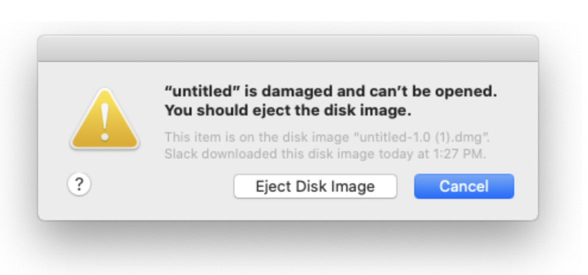

# Native distributions & local execution

## What is covered

In this tutorial, we'll show you how to create native distributions (installers/packages) for all the supported systems.
We will also demonstrate how to run an application locally with the same settings as for distributions.

## Gradle plugin

`org.jetbrains.compose` Gradle plugin simplifies the packaging of applications into native distributions and running an application locally.
Currently, the plugin uses [jpackage](https://openjdk.java.net/jeps/343) for packaging self-contained applications.

## Basic usage

The basic unit of configuration in the plugin is an `application`.
An `application` defines a shared configuration for a set of final binaries. 
In other words, an `application` in DSL allows you to pack a bunch of files,
together with a JDK distribution, into a set of compressed binary installers
in various formats (`.dmg`, `.deb`, `.msi`, `.exe`, etc).

``` kotlin
import org.jetbrains.compose.compose
import org.jetbrains.compose.desktop.application.dsl.TargetFormat

plugins {
    kotlin("jvm")
    id("org.jetbrains.compose")
}

dependencies {
    implementation(compose.desktop.currentOS)
}

compose.desktop {
    application {
        mainClass = "example.MainKt"

        nativeDistributions {
            targetFormats(TargetFormat.Dmg, TargetFormat.Msi, TargetFormat.Deb)
        }
    }
}
```

The plugin creates the following tasks:
* `package<FormatName>` (e.g. `packageDmg` or `packageMsi`) are used for packaging the app into the corresponding format.
Note, that there is no cross-compilation support available at the moment,
so the formats can only be built using the specific OS (e.g. to build `.dmg` you have to use macOS).
Tasks that are not compatible with the current OS are skipped by default.
* `package` is a [lifecycle](https://docs.gradle.org/current/userguide/more_about_tasks.html#sec:lifecycle_tasks) task,
aggregating all package tasks for an application.
* `packageUberJarForCurrentOS` is used to create a single jar file, containing all dependencies for current OS. 
The task is available starting from the M2 release.
The task expects `compose.desktop.currentOS` to be used as a `compile`/`implementation`/`runtime` dependency.
* `run` is used to run an app locally. You need to define a `mainClass` — an fq-name of a class, 
containing the `main` function.
Note, that `run` starts a non-packaged JVM application with full runtime.
This is faster and easier to debug, than creating a compact binary image with minified runtime.
To run a final binary image, use `runDistributable` instead.
* `createDistributable` is used to create a prepackaged application image a final application image without creating an installer. 
* `runDistributable` is used to run a prepackaged application image. 
  
Note, that the tasks are created only if the `application` block/property is used in a script.

After a build, output binaries can be found in `${project.buildDir}/compose/binaries`.

## Available formats

The following formats available for the supported operating systems:
* macOS — `.dmg` (`TargetFormat.Dmg`), `.pkg` (`TargetFormat.Pkg`)
* Windows — `.exe` (`TargetFormat.Exe`), `.msi` (`TargetFormat.Msi`)
* Linux — `.deb` (`TargetFormat.Deb`), `.rpm` (`TargetFormat.Rpm`)

## Signing & notarization on macOS

By default, Apple does not allow users to execute unsigned applications downloaded from the internet.  Users attempting
to run such applications will be faced with an error like this:



See [our tutorial](tutorials/Signing_and_notarization_on_macOS/README.md) 
on how to sign and notarize your application. 

## Customizing JDK version

The plugin uses `jpackage`, which is available since [JDK 14](https://openjdk.java.net/projects/jdk/14/).
Make sure you meet at least one of the following requirements:
* `JAVA_HOME` environment variable points to the compatible JDK version.
* `javaHome` is set via DSL:
``` kotlin
compose.desktop {
    application {
        javaHome = System.getenv("JDK_14")
    }
}
``` 

## Customizing output dir

``` kotlin
compose.desktop {
    application {
        nativeDistributions {
            outputBaseDir.set(project.buildDir.resolve("customOutputDir"))
        }
    }
}
```

## Customizing launcher

The following properties are available for customizing the application startup:
* `mainClass` — a fully-qualified name of a class, containing the main method;
* `args` — arguments for the application's main method;
* `jvmArgs` — arguments for the application's JVM.

``` kotlin
compose.desktop {
    application {
        mainClass = "MainKt"
        jvmArgs += listOf("-Xmx2G") 
        args += listOf("-customArgument") 
    }
}
```

## Customizing metadata

The following properties are available in the `nativeDistributions` DSL block:
* `packageName` — application's name (default value: Gradle project's [name](https://docs.gradle.org/current/javadoc/org/gradle/api/Project.html#getName--));
* `version` — application's version (default value: Gradle project's [version](https://docs.gradle.org/current/javadoc/org/gradle/api/Project.html#getVersion--));
* `description` — application's description (default value: none);
* `copyright` — application's copyright (default value: none);
* `vendor` — application's vendor (default value: none).

``` kotlin
compose.desktop {
    application {
        nativeDistributions {
            packageName = "ExampleApp"
            version = "0.1-SNAPSHOT"
            description = "Compose Example App"
            copyright = "© 2020 My Name. All rights reserved."
            vendor = "Example vendor"
        }
    }
}
```

## Customizing content

The plugin can configure itself, when either `org.jetbrains.kotlin.jvm` or `org.jetbrains.kotlin.multiplatform` plugins 
are used.

* With `org.jetbrains.kotlin.jvm` the plugin includes content from the `main` [source set](https://docs.gradle.org/current/userguide/java_plugin.html#source_sets).
* With `org.jetbrains.kotlin.multiplatform` the plugin includes content a single [jvm target](https://kotlinlang.org/docs/reference/mpp-dsl-reference.html#targets).
The default configuration is disabled if multiple JVM targets are defined. In this case, the plugin should be configured
manually, or a single target should be specified (see below).

If the default configuration is ambiguous or not sufficient, the plugin can be configured:
* Using a Gradle [source set](https://docs.gradle.org/current/userguide/java_plugin.html#source_sets)
``` kotlin
plugins {
    kotlin("jvm")
    id("org.jetbrains.compose")
} 

val customSourceSet = sourceSets.create("customSourceSet")
compose.desktop {
    application {
        from(customSourceSet)
    }
}
```
* Using a Kotlin [JVM target](https://kotlinlang.org/docs/reference/mpp-dsl-reference.html#targets):
``` kotlin
plugins {
    kotlin("multiplatform")
    id("org.jetbrains.compose")
} 

kotlin {
    jvm("customJvmTarget") {}
}

compose.desktop {
    application {
        from(kotlin.targets["customJvmTarget"])
    }
}
```
* manually:
     * `disableDefaultConfiguration` can be used to disable the default configuration;
     * `dependsOn` can be used to add task dependencies to all plugin's tasks;
     * `fromFiles` can be used to specify files to include;
     * `mainJar` file property can be specified to point to a jar, containing a main class.
``` kotlin
compose.desktop {
    application {
        disableDefaultConfiguration()
        fromFiles(project.fileTree("libs/") { include("**/*.jar") })
        mainJar.set(project.file("main.jar"))
        dependsOn("mainJarTask")
    }
}
```

## App icon

The app icon needs to be provided in OS-specific formats:
* `.icns` for macOS;
* `.ico` for Windows;
* `.png` for Linux.

``` kotlin
compose.desktop {
    application {
        nativeDistributions {
            macOS {
                iconFile.set(project.file("icon.icns"))
            }
            windows {
                iconFile.set(project.file("icon.ico"))
            }
            linux {
                iconFile.set(project.file("icon.png"))
            }
        }
    }
}
```
