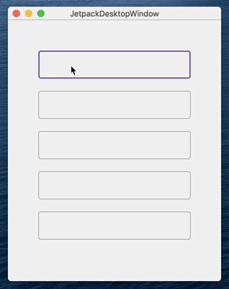
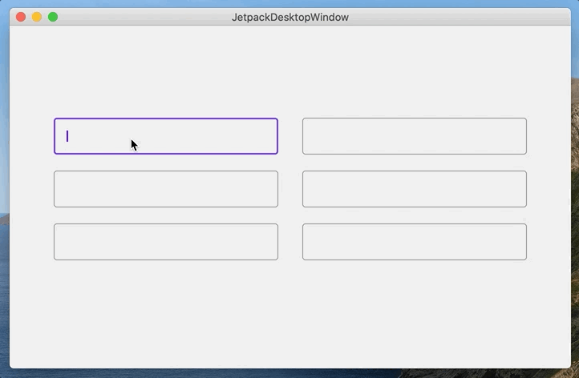

# Tabbing navigation and keyboard focus

## What is covered

In this tutorial, we will show you how to use tabbing navigation between components via keyboard shortcuts `tab` and `shift+tab`.

## Simple example

```kotlin
import androidx.compose.desktop.Window
import androidx.compose.foundation.layout.Box
import androidx.compose.foundation.layout.Column
import androidx.compose.foundation.layout.fillMaxSize
import androidx.compose.foundation.layout.height
import androidx.compose.foundation.layout.padding
import androidx.compose.foundation.layout.Spacer
import androidx.compose.material.OutlinedTextField
import androidx.compose.runtime.getValue
import androidx.compose.runtime.mutableStateOf
import androidx.compose.runtime.remember
import androidx.compose.runtime.setValue
import androidx.compose.ui.ExperimentalComposeUiApi
import androidx.compose.ui.focus.FocusRequester
import androidx.compose.ui.focus.focusOrder
import androidx.compose.ui.Alignment
import androidx.compose.ui.Modifier
import androidx.compose.ui.unit.dp
import androidx.compose.ui.unit.IntSize

@OptIn(ExperimentalComposeUiApi::class)
fun main() = Window(size = IntSize(350, 450)) {
    val itemsList = remember { List(5) { FocusRequester() } }
    Box(
        modifier = Modifier.fillMaxSize(),
        contentAlignment = Alignment.Center
    ) {
        Column(
            modifier = Modifier.padding(50.dp)
        ) {
            itemsList.forEachIndexed { index, item ->
                val text = remember { mutableStateOf("") }
                OutlinedTextField(
                    value = text.value,
                    singleLine = true,
                    onValueChange = { text.value = it },
                    modifier = Modifier.height(46.dp).focusOrder(item) {
                        next = if (index + 1 == itemsList.size) itemsList.first() else itemsList[index + 1]
                        previous = if (index - 1 < 0) itemsList.last() else itemsList[index - 1]
                    }
                )
                Spacer(modifier = Modifier.height(20.dp))
            }
        }
    }
}
```


## Tabbing navigation with auto ordering

```kotlin
import androidx.compose.desktop.Window
import androidx.compose.foundation.layout.Box
import androidx.compose.foundation.layout.Column
import androidx.compose.foundation.layout.Row
import androidx.compose.foundation.layout.fillMaxSize
import androidx.compose.foundation.layout.height
import androidx.compose.foundation.layout.padding
import androidx.compose.foundation.layout.Spacer
import androidx.compose.material.OutlinedTextField
import androidx.compose.runtime.Composable
import androidx.compose.runtime.getValue
import androidx.compose.runtime.mutableStateOf
import androidx.compose.runtime.remember
import androidx.compose.runtime.setValue
import androidx.compose.ui.ExperimentalComposeUiApi
import androidx.compose.ui.focus.FocusRequester
import androidx.compose.ui.focus.focusOrder
import androidx.compose.ui.Alignment
import androidx.compose.ui.Modifier
import androidx.compose.ui.unit.dp
import androidx.compose.ui.unit.IntSize

class FocusGroup {
    private val list = mutableListOf(FocusRequester())
    private var current = 0
    
    fun register(isTail: Boolean = false): FocusRequester {
        if (!isTail) {
            list.add(FocusRequester())
        }
        return list[current++]
    }

    fun next(): FocusRequester {
        return if (current >= list.size) list.last() else list[current]
    }

    fun previous(): FocusRequester {
        return if (current - 2 < 0) list.first() else list[current - 2]
    }
}

@OptIn(ExperimentalComposeUiApi::class)
fun main() = Window(size = IntSize(700, 450)) {

    val group1 = remember { FocusGroup() }
    val group2 = remember { FocusGroup() }

    Box(
        modifier = Modifier.fillMaxSize(),
        contentAlignment = Alignment.Center
    ) {
        Row {
            Column(modifier = Modifier.padding(15.dp)) {
                FocusableTextField(focusGroup = group1)
                FocusableTextField(focusGroup = group1)
                FocusableTextField(focusGroup = group1, isTail = true)
            }
            Column(modifier = Modifier.padding(15.dp)) {
                FocusableTextField(focusGroup = group2)
                FocusableTextField(focusGroup = group2)
                FocusableTextField(focusGroup = group2, isTail = true)
            }
        }
    }
}

@Composable
fun FocusableTextField(focusGroup: FocusGroup, isTail: Boolean = false) {
    val text = remember { mutableStateOf("") }
    
    val currentItem = remember { focusGroup.register(isTail) }
    val nextItem = remember { focusGroup.next() }
    val previousItem = remember { focusGroup.previous() }

    OutlinedTextField(
        value = text.value,
        singleLine = true,
        onValueChange = { text.value = it },
        modifier = Modifier.height(46.dp).focusOrder(currentItem) {
            next = nextItem
            previous = previousItem
        }
    )
    Spacer(modifier = Modifier.height(20.dp))
}
```

