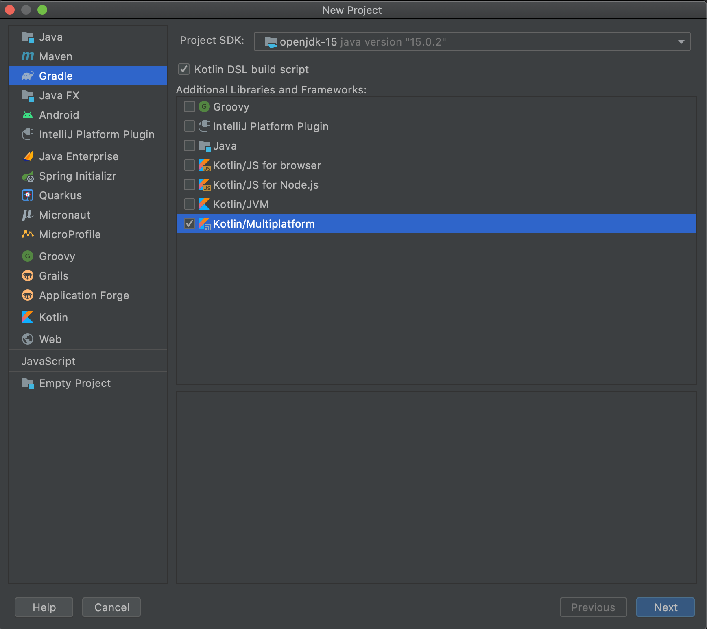
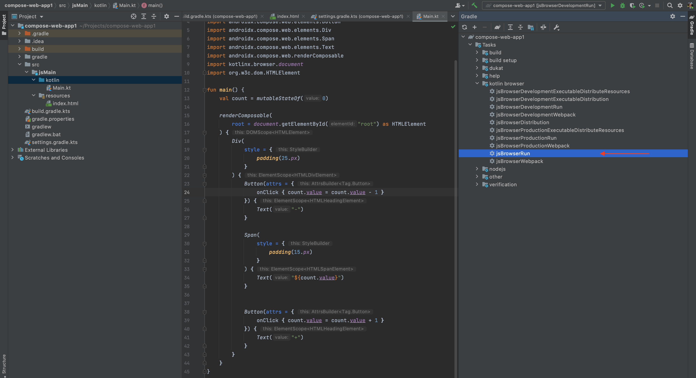

# Getting Started with Compose for Web

**The API is experimental and breaking changes can be expected**

## What is covered

In this tutorial we will create a simple web UI application
using the Compose UI framework.

## Prerequisites

The following software has to be preinstalled:
* JDK 11 or later
* IntelliJ IDEA Community Edition or Ultimate Edition 20.2 or later (other editors could be used, but we assume you are using IntelliJ IDEA in this tutorial)


## Creating a new project

If you don't want to create the project manually, [download the example here]()

The project wizard doesn't support Compose for Web projects yet.
Therefore, the next steps need to be done:

#### 1. Create a Kotlin Multiplatform project:
- Select `Gradle` on the left menu
- Tick `Kotlin DSL build script`
- Tick `Kotlin/Multiplatform`




#### 2. Update `settings.gradle.kts`:
``` kotlin
pluginManagement {
    repositories {
        gradlePluginPortal()
        maven("https://maven.pkg.jetbrains.space/public/p/compose/dev")
    }
}
```

#### 3. Update `build.gradle.kts`:
```kotlin
// Add compose gradle plugin
plugins {
    kotlin("multiplatform") version "1.4.32"
    id("org.jetbrains.compose") version "0.0.0-web-dev-5"
}

// Add maven repositories
repositories {
    mavenCentral()
    maven("https://maven.pkg.jetbrains.space/public/p/compose/dev")
}

// Enable JS(IR) target and add dependencies
kotlin {
    js(IR) {
        browser()
        binaries.executable()
    }
    val jsMain by getting {
        dependencies {
            implementation(compose.web.web)
            implementation(compose.runtime)
        }
    }
}
```

#### 5. Add the following directories to the project:
- src/jsMain/kotlin
- src/jsMain/resources

#### 6. Add `index.html` file to the `resources`:
```html
<!DOCTYPE html>
<html lang="en">
<head>
    <meta charset="UTF-8">
    <title>Sample</title>
</head>
<body>
  <div id="root"></div>
  <script src="{REPLACE_WITH_YOUR_MODULE_NAME}.js"></script>
</body>
</html>
```

#### 7. Add `Main.kt` file:
```kotlin
fun main() {
    val count = mutableStateOf(0)

    renderComposable(rootElementId = "root") {
        Div(style = { padding(25.px) }) {
            Button(attrs = {
                onClick { count.value = count.value - 1 }
            }) {
                Text("-")
            }

            Span(style = { padding(15.px) }) {
                Text("${count.value}")
            }


            Button(attrs = {
                onClick { count.value = count.value + 1 }
            }) {
                Text("+")
            }
        }
    }
}
```

## Running the project

Using the command line:

```shell
./gradlew jsRun
```

Or from the IDE:



The browser will open `localhost:8080`:


